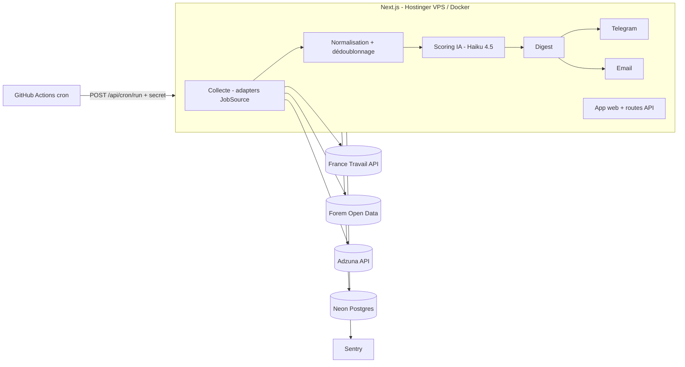

# Architecture — Trouvio

## 1. Vue d'ensemble


## 2. Principes
- **Monolithe modulaire** : un seul déploiement Next.js, découpé en domaines (`features/`). Pas de microservices tant qu'un besoin réel ne l'impose pas.
- **Cœur pur, bords impurs** : la logique métier ne dépend ni de la DB, ni de HTTP, ni du LLM ; ces dépendances sont injectées → testable sans réseau.
- **Tout est idempotent** : collecte (upsert sur `source + external_id`), scoring (unique `user_id + offer_id`), envoi (unique `user_id + channel + digest_date`).
- **Échec partiel toléré** : chaque source et chaque utilisateur sont traités isolément ; les erreurs sont journalisées et remontées à Sentry sans bloquer le reste.

## 3. Arborescence cible
```
src/
  app/
    (public)/            accueil, fonctionnalites, tarifs, contact, legal/*
    (auth)/              connexion, inscription
    (app)/               fil, offres/[id], suivi, statistiques, configuration
    admin/               tableau de bord admin (rôle requis)
    api/
      cron/run/route.ts  point d'entrée du job quotidien (protégé)
      webhooks/          stripe, telegram
  features/
    sources/             JobSource + adapters (france-travail, forem, adzuna)
    offers/              normalisation, dédoublonnage, requêtes
    scoring/             prompt, appel LLM, validation, coûts
    digest/              sélection, mise en forme, envoi
    tracking/            suivi des candidatures
    profile/             critères de recherche
    billing/             Stripe (phase 9)
  lib/                   db, env, llm, logger, auth, rate-limit, http
  components/ui/         shadcn
db/                      schema.ts, migrations/
prompts/                 scoring.v1.md, ...
evals/                   jeu de référence + script d'évaluation
tests/e2e/               Playwright
```

## 4. Interface des sources
```ts
export interface JobSource {
  id: 'france-travail' | 'forem' | 'adzuna';
  search(criteria: SearchCriteria, since: Date): Promise<RawOffer[]>;
  normalize(raw: RawOffer): NormalizedOffer; // fonction pure, testée par fixtures
}
```
Chaque adapter : client HTTP avec timeout, 3 tentatives avec backoff exponentiel, respect des quotas, fixtures JSON réelles anonymisées dans `features/sources/<id>/__fixtures__/` pour les tests de contrat.

## 5. Modèle de données (Drizzle)
| Table | Colonnes clés | Contraintes |
|---|---|---|
| `users` | id, email, name, role (`user`/`admin`), plan, created_at | email unique |
| `search_profiles` | user_id, titles[], skills[], years_exp, languages[], zone, remote_mode, contracts[], min_salary, threshold, channels jsonb, send_hour, frequency | 1 par user |
| `job_offers` | id, source, external_id, dedup_hash, title, company, location, contract, salary_min, salary_max, remote, description, url, published_at, raw jsonb | unique (source, external_id) ; index dedup_hash |
| `offer_scores` | user_id, offer_id, score, strengths[], concerns[], reason, status (`scored`/`unscored`), model, prompt_version, input_tokens, output_tokens, cost_usd, created_at | unique (user_id, offer_id) |
| `offer_feedback` | user_id, offer_id, verdict (`not_relevant`/`relevant`), created_at | unique (user_id, offer_id) |
| `applications` | id, user_id, offer_id, status (`to_review`/`applied`/`follow_up`/`closed`), applied_at, notes, updated_at | unique (user_id, offer_id) |
| `deliveries` | id, user_id, channel, digest_date, offer_ids[], status, error | unique (user_id, channel, digest_date) |
| `job_runs` | id, kind, started_at, finished_at, status, stats jsonb | — |
| Better Auth | sessions, accounts, verifications | gérées par la bibliothèque |

**Dédoublonnage** : `dedup_hash = sha256(norm(company) + norm(title) + norm(city))`. Une offre vue sur deux sources n'est scorée et envoyée qu'une fois.

## 6. Flux du job quotidien
1. `POST /api/cron/run` (Bearer `CRON_SECRET`, comparaison à temps constant) → crée un `job_runs`.
2. Pour chaque source active : collecte depuis le dernier run réussi → upsert `job_offers`.
3. Pour chaque utilisateur dont l'heure d'envoi est atteinte : filtre dur (contrat, zone, exclusions, feedback négatif) → offres non encore scorées → scoring par lots (concurrence limitée à 5) → enregistrement.
4. Sélection ≥ seuil, tri par score, max 10 par digest → envoi par canal → `deliveries`.
5. Clôture du `job_runs` avec statistiques (offres collectées, scorées, coût, erreurs).

## 7. Sécurité (résumé — détail dans SECURITY.md)
Sessions HTTP-only, contrôle d'appartenance systématique, en-têtes de sécurité (CSP, HSTS), rate limiting sur auth/contact/API, secrets uniquement en variables d'environnement, dépendances surveillées (Dependabot + audit), scan de secrets (gitleaks), analyse statique (CodeQL).
