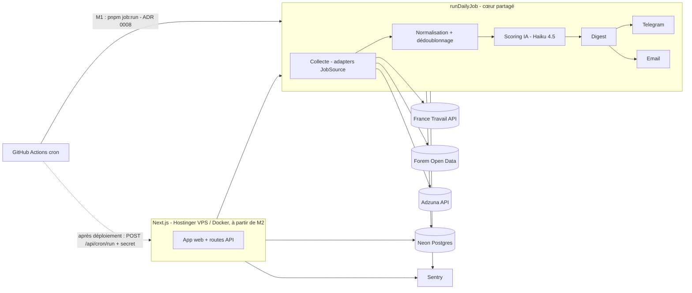

# Architecture — Trouvio

## 1. Vue d'ensemble


## 2. Principes
- **Monolithe modulaire** : un seul dépôt Next.js, découpé en domaines (`features/`). Pas de microservices tant qu'un besoin réel ne l'impose pas.
- **Job indépendant du serveur web** (ADR 0008) : `runDailyJob()` ne dépend pas de Next.js ; il est lancé par `pnpm job:run` (GitHub Actions, M1) et, plus tard, par la route `/api/cron/run`.
- **Cœur pur, bords impurs** : la logique métier ne dépend ni de la DB, ni de HTTP, ni du LLM ; ces dépendances sont injectées → testable sans réseau.
- **Tout est idempotent** : collecte (upsert sur `source + external_id`), scoring (unique `user_id + offer_id`), envoi (unique `user_id + channel + digest_date`).
- **Échec partiel toléré** : chaque source et chaque utilisateur sont traités isolément ; les erreurs sont journalisées et remontées à Sentry sans bloquer le reste.

## 3. Arborescence cible
```
src/
  app/
    (public)/            accueil, fonctionnalites, tarifs, contact, legal/*
    (auth)/              connexion, inscription
    (app)/               fil, offres/[id], suivi, statistiques, configuration
    admin/               tableau de bord admin (rôle requis)
    api/
      cron/run/route.ts  point d'entrée HTTP du job, après déploiement (protégé, P10-05)
      webhooks/          stripe, telegram
  features/
    sources/             JobSource + adapters (france-travail, forem, adzuna)
    offers/              normalisation, dédoublonnage, requêtes
    scoring/             prompt, appel LLM, validation, coûts
    digest/              sélection, mise en forme, envoi
    tracking/            suivi des candidatures
    profile/             critères de recherche
    jobs/                runDailyJob() : orchestration du job quotidien (ADR 0008)
    billing/             Stripe (phase 9)
  lib/                   db, env, llm, logger, observability (options Sentry), auth, rate-limit, http, design-tokens (charte validée), utils (cn)
  components/ui/         shadcn
  components/magicui/    effets Magic UI, liste fermée (ADR 0007)
  test/                  harnais de tests : setup Vitest, serveur MSW partagé
db/                      schema.ts, migrations/, seed.example.json, local/ (Postgres Docker non secret, ADR 0012)
scripts/                 job-run.ts (point d'entrée CLI du job), db-migrate.ts, db-seed.ts, test-hooks.sh
prompts/                 scoring.v1.md, ...
evals/                   jeu de référence + script d'évaluation
tests/e2e/               Playwright (build de production, axe)
```

## 4. Interface des sources
```ts
export interface JobSource {
  id: 'france-travail' | 'forem' | 'adzuna';
  search(criteria: SearchCriteria, since: Date): Promise<RawOffer[]>;
  normalize(raw: RawOffer): NormalizedOffer; // fonction pure, testée par fixtures
}
```
Chaque adapter : client HTTP avec timeout, 3 tentatives avec backoff exponentiel, respect des quotas, fixtures JSON réelles anonymisées dans `features/sources/<id>/__fixtures__/` pour les tests de contrat.

## 5. Modèle de données (Drizzle)
| Table | Colonnes clés | Contraintes |
|---|---|---|
| `users` | id, email, name, email_verified, image, role (`user`/`admin`), plan (`free`/`economy`/`comfort`), created_at, updated_at | email unique, en minuscules |
| `search_profiles` | user_id, titles[], skills[], years_exp, languages[], zone, remote_modes[], contracts[], min_salary, excluded_keywords[], excluded_companies[], threshold, channels jsonb, send_hour, frequency | 1 par user (clé primaire user_id) ; threshold 0–100, send_hour 0–23 |
| `job_offers` | id, source, external_id, dedup_hash, canonical_offer_id (null = offre canonique), title, company, location, contract, salary_min, salary_max, remote, description, url, published_at, raw jsonb | unique (source, external_id) ; index dedup_hash ; FK canonical_offer_id → job_offers.id |
| `offer_scores` | user_id, offer_id, score, strengths[], concerns[], reason, status (`scored`/`unscored`), model, prompt_version, input_tokens, output_tokens, cost_usd, created_at | unique (user_id, offer_id) |
| `offer_feedback` | user_id, offer_id, verdict (`not_relevant`/`relevant`), created_at | unique (user_id, offer_id) |
| `applications` | id, user_id, offer_id, status (`to_review`/`applied`/`follow_up`/`closed`), applied_at, notes, updated_at | unique (user_id, offer_id) ; offer_id en `restrict` |
| `deliveries` | id, user_id, channel, digest_date, offer_ids[], status, error, sent_at | unique (user_id, channel, digest_date) ; 10 offres au plus |
| `job_runs` | id, kind, started_at, finished_at, status, stats jsonb | — |
| Better Auth | sessions, accounts, verifications | gérées par la bibliothèque, ajoutées en P1-02 (`users` est déjà sa table utilisateur) |

**Conventions (P1-01, `db/schema.ts`)** :
- noms SQL en snake_case ; identifiants `uuid` par `gen_random_uuid()` ; horodatages `timestamptz` ;
- enums Postgres dont les valeurs, en anglais, viennent de `src/lib/db/enums.ts` (partagées avec Zod) ; les libellés français vivent dans l'interface ;
- `min_salary` est un salaire brut annuel en euros ; `send_hour`, une heure de Bruxelles ; `zone`, un texte libre en attendant P2-00 ;
- `remote_mode` devient le tableau `remote_modes` : un profil accepte plusieurs modes ;
- **toute table à `user_id` le référence en cascade et commence une clé ou un index par lui** : la suppression de compte est effective, et les requêtes scopées (P1-03) sont indexées. Invariants vérifiés par `src/lib/db/schema.test.ts` ;
- `applications.offer_id` est en `restrict` : une purge des offres n'efface pas l'historique des candidatures.

**Dédoublonnage** : `dedup_hash = sha256(norm(company) + norm(title) + norm(city))`, utilisé **uniquement entre sources différentes**. Dans une même source, `external_id` fait foi : deux offres distinctes au même intitulé ne sont jamais fusionnées. Quand une offre d'une autre source a le même hash, elle pointe vers l'offre canonique (`canonical_offer_id`) ; seules les offres canoniques sont scorées et envoyées.

## 6. Flux du job quotidien
1. Déclenchement : `pnpm job:run` dans GitHub Actions (M1, ADR 0008) ou, après déploiement, `POST /api/cron/run` (Bearer `CRON_SECRET`, comparaison à temps constant). Verrou `pg_advisory_lock` : un seul job à la fois, quel que soit le point d'entrée → crée un `job_runs`.
2. Pour chaque source active : collecte depuis le dernier run réussi → upsert `job_offers`.
3. Pour chaque utilisateur dont l'heure d'envoi est atteinte : filtre dur (contrat, zone, mots-clés et entreprises exclus, feedback négatif) → offres non encore scorées → scoring par lots (concurrence limitée à 5) → enregistrement.
4. Sélection ≥ seuil, tri par score, max 10 par digest → envoi par canal → `deliveries`.
5. Clôture du `job_runs` avec statistiques (offres collectées, scorées, coût, erreurs).

## 7. Sécurité (résumé — détail dans SECURITY.md)
Sessions HTTP-only, contrôle d'appartenance systématique, en-têtes de sécurité (CSP, HSTS), rate limiting sur auth/contact/API, secrets uniquement en variables d'environnement, dépendances surveillées (Dependabot, audit, dependency-review), scan de secrets (push protection GitHub + gitleaks), analyse statique (CodeQL) — détail dans SECURITY §6.

## 8. Configuration (variables d'environnement)
- **Seul point d'accès** : `src/lib/env.ts` (interdit ailleurs par ESLint et par le hook `guard-code`).
- **Domaines** : `core`, `database`, `databaseMigration`, `testDatabase`, `auth`, `anthropic`, `franceTravail`, `adzuna`, `telegram`, `email`, `sentry`, `cron`. Toutes les variables prévues sont déclarées et documentées dans `.env.example`.
- **Exigés au démarrage** selon le runtime (`STARTUP_DOMAINS`) : aujourd'hui `core` et `sentry` pour `web` et `job` (le DSN reste optionnel, mais un DSN invalide empêche le démarrage au lieu de désactiver Sentry sans rien dire). **Chaque tâche qui met un domaine en service l'y ajoute** (un test vérifie la table exacte) ; les autres domaines sont validés au premier accès (`getEnv("anthropic")`).
- **Où** : `next.config.ts`, uniquement pour les phases serveur (`next start`, `next dev`) ; futur CLI du job (`scripts/job-run.ts`) : première instruction. Le **build n'exige aucun secret**. (`instrumentation.ts` ne convient pas : chargé après « Ready », une erreur y laisse le processus vivant.)
- **Limite `standalone` (production, ADR 0006)** : le `server.js` généré embarque la config figée au build et **n'évalue pas** `next.config.ts` au démarrage. Le point d'entrée du conteneur doit donc appeler `assertStartupEnv("web")` avant de charger `server.js` (P10-02).
- **Erreurs** : noms des variables manquantes ou invalides, jamais leurs valeurs.
- **Bases (P1-01, ADR 0012)** : `DATABASE_URL` (rôle applicatif, DML) et `DATABASE_MIGRATION_URL` (rôle propriétaire, lu par `db:migrate` seulement) exigent `sslmode=require` ou `verify-full` hors boucle locale. `TEST_DATABASE_URL` vaut par défaut la base Docker `127.0.0.1:54329` et refuse tout hôte hors boucle locale. Les commandes `db:*:local` lisent `db/local/dev.vars` (non secret) ; `db:*:neon` lisent `.env.local` et ne se lancent que dans le terminal de l'utilisateur.
- **Valeurs publiées au navigateur** : seulement `SENTRY_DSN` et `NODE_ENV`, figés au build par `compiler.define` (`publicBuildEnv()`, lus par `src/lib/observability/public-config.ts`). Aucune variable `NEXT_PUBLIC_`. En production (P10-02), le DSN doit donc être présent **au build**. Le DSN n'est accepté qu'en région UE (`https://<clé>@o<id>.ingest.de.sentry.io/<projet>`, `SENTRY_EU_INGEST_HOST`), sans clé secrète, port, query ni fragment (P0-07).
- **`LOG_LEVEL`** (domaine `core`) : `debug | info | warn | error | silent`, `info` par défaut ; `silent` pendant les tests (Vitest).
- **Variables interdites** : `SENTRY_TRACES_SAMPLE_RATE`, que le SDK Sentry lirait hors `env.ts` pour activer les traces, fait refuser le démarrage (`assertStartupEnv`). `SENTRY_NAME` et `SENTRY_SPOTLIGHT` sont neutralisées par les options du SDK.

## 9. Journaux et erreurs (P0-06, ADR 0010)
- **Journaliser** : `import { logger } from "@/lib/logger"` (serveur), `logger.child({ source })` pour lier un contexte. Aucun `console.*` dans `src/` (ESLint). Une ligne JSON par événement : `time`, `level`, `msg`, `service`, `runtime` (`web` | `job`), `ctx` (contexte masqué), `err` (erreur sérialisée, chaîne `cause` comprise). `debug` et `info` sur stdout, `warn` et `error` sur stderr.
- **Erreur** : `logger.error("…", { source, err })` écrit la ligne ET signale à Sentry (via `@sentry/core`). Seule la clé **`err`** porte l'erreur : sous `error`, elle ne serait qu'un objet `{ name, message }` sans pile. `warn` ne signale jamais. Règle : **journaliser OU relancer**, pas les deux. Le logger ne lève jamais, même sur un contexte illisible (`ctx: { illisible: true }`).
- **Masquage** : clés sensibles (mots de passe, jetons, cookies, emails, noms, IP, salaire, CV…) et motifs dans les valeurs (emails même encodés, Bearer, Basic, JWT, `sk-ant-`, `re_`, jeton Telegram, paramètres `app_key`/`token`/`email`/`sig`… d'une URL ou d'un corps, champs JSON de jetons, IBAN, téléphones FR/BE, identifiants d'URL de connexion). Taille bornée : 50 éléments ou clés par niveau, 1 000 valeurs et 20 erreurs par appel, binaires résumés. Ne jamais journaliser un objet utilisateur ou un profil entier : passer l'`userId` (UUID interne).
- **Sentry** : initialisé seulement avec un DSN. Serveur : `src/instrumentation.ts` (runtime Node uniquement ; une route edge ne serait pas surveillée) et `onRequestError`. Navigateur : `src/instrumentation-client.ts`. Rendu racine en échec : `src/app/global-error.tsx` (erreurs nées dans le navigateur ; celles du serveur, avec `digest`, sont déjà signalées). Même politique partout (`src/lib/observability/sentry-options.ts`) : collecte minimale, ni replay, ni traces, ni sessions, ni journaux ou métriques Sentry. `@sentry/*` ne s'importe que dans ces points d'intégration (ESLint) ; `Sentry.setUser` ne reçoit jamais que `{ id }`.
- **Job (P5)** : `createDefaultLogger({ runtime: "job" })`, `@sentry/node` à la version exacte de `@sentry/core`, `init` avec `buildSentryOptions`, `await Sentry.flush(2000)` avant la sortie. Journaux Actions publics : agrégats seulement.
